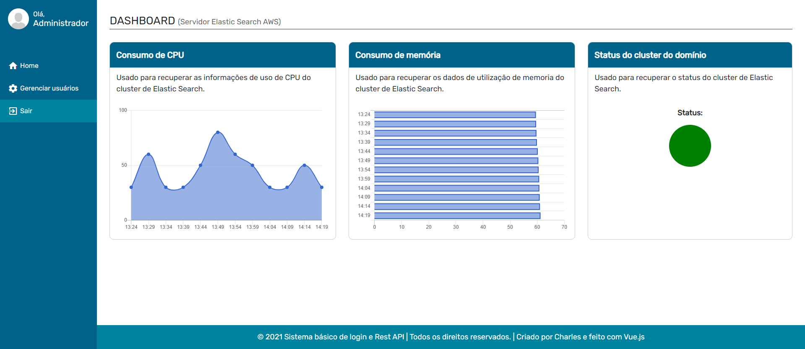
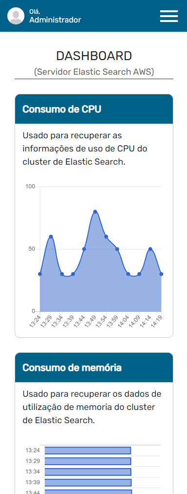

# Login básico e API REST utilizando o NodeJS e Express

Este é um projeto básico com sistema de login usando token, possui um controle da lista de usuários e foi feito em uma página SPA usando Vue.js, acessando páginas com rotas e consome uma API para recuperar as informações da saúde do Elastic Search hospedado na aws e o exibe em gráfico usando Chart.js e Vue Chartkick. Consome uma API Rest com lista de usuários, autenticação e verificação de sessão que mantém por 2 horas usando o token JWT (você pode mudar o tempo de sessão).

<h2 align="center">
  
  
</h2>

## Tecnologias utilizadas:
  - [Node.js](https://nodejs.org)
  - [NPM](https://www.npmjs.com/)
  - [Vue CLI](https://cli.vuejs.org/)
  - [Vue.js](https://vuejs.org/)
  - [Vuex](https://vuex.vuejs.org/)
  - [Vue Router](https://router.vuejs.org/)
  - [Vue Resource](https://github.com/pagekit/vue-resource)
  - [Vue Chartkick](https://chartkick.com/vue)
  - [jsonwebtoken](https://www.npmjs.com/package/jsonwebtoken)

<br />

## Instalando as dependências e rodando o projeto na pasta Raiz:
```
npm install && npm run serve
```

## Integrando com a API

Você pode integrar esse projeto com Mongo DB, criando um arquivo e adicionar o código do Mongoose e criar um Schema com Mongoose. Fazendo isso você pode alimentar o banco do Mongo DB usando método POST. No momento o backend usa um JSON com os dados dos usuários prontos para teste local sem usar Mongo DB.

<br />

## Rodando a API em sua máquina
O servidor irá rodar na `porta 5000` quando excutar o comando na pasta `webserver`.

- Acesse a pasta webserver;
- Instale as dependências usando `npm i`
- Inicie o servidor local usando `npm run start`
